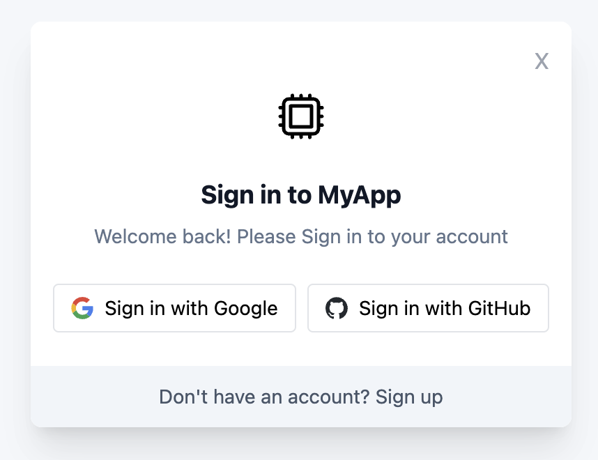

### OAuthify

The OAuthify library provides a seamless integration for adding OAuth-based login functionality into your React application. This package comes with pre-built headless components for Google and GitHub login buttons, making the OAuth flow implementation straightforward and efficient.

### Key Features

- **Easy Integration:** Simplifies the addition of Google and GitHub login buttons to your React app.
- **Secure Authentication:** Redirects users to the respective service's login page and securely handles the OAuth callback.
- **Customizable:** Allows for custom handling of successful or failed logins, enabling you to tailor the user experience.

<<<<<<< HEAD
<!--  -->

<p align="center">
  
</p>
=======

>>>>>>> e254e27 (updated readme)

### Installation

To install OAuthify, run:

```bash
npm install oauthify
```

### Usage

Implementing OAuthify in your React application involves three simple steps:

1. Wrap your application with `<OAuthifyProvider />`.
2. Add the `<OAuthifyRedirect />` component to handle the OAuth callback.
3. Utilize the `<GoogleLoginButton />` or `<GithubLoginButton />` components as needed.

### Detailed Steps

#### OAuthifyProvider

To use the OAuthify Provider, wrap your entire application with `<OAuthifyProvider>`:

```javascript
import React from 'react';
import {
  OAuthifyProvider,
  GoogleLoginButton,
  GitHubLoginButton,
  GoogleIcon,
  GithubIcon,
} from 'oauthify';
<<<<<<< HEAD
=======
import { useAuth } from './contexts/Auth.context';

>>>>>>> e254e27 (updated readme)
const googleClientId = 'xxxxxxxxx';
const githubClientId = 'XXXXXXXX';

const App = () => {
<<<<<<< HEAD
  const handleSuccess = (response) => {
    console.log('Google login success:', response);
    // Handle successful login, e.g., set user info in app state
  };

  const handleFailure = (error) => {
    console.error('Google login failure:', error);
    // Handle failed login, e.g., show error message to user
  };

=======
>>>>>>> e254e27 (updated readme)
  return (
    <OAuthifyProvider>
      <div>
        <h1>My App</h1>
        <LoginComponent />
      </div>
    </OAuthifyProvider>
  );
};

const LoginComponent = () => {
<<<<<<< HEAD
  return (
    <>
      <div className="flex flex-row justify-center items-center my-6 space-x-2">
        <GoogleLoginButton
          clientId={googleClientId}
          redirectUri={redirectUri}
          onSuccess={handleSuccess}
          onFailure={handleFailure}
        >
=======
  const { onSuccess, onFailure, setOnSuccess } = useOAuthify();

  const handleSuccess = () => {
    // Handle the success state of LoginWithGoogle or LoginWithGithub
  };
  const handleFailure = () => {
    // Handle the success state of LoginWithGoogle or LoginWithGithub
  };

  React.useEffect(() => {
    handleSuccess();
  }, [onSuccess]);

  React.useEffect(() => {
    handleFailure();
  }, [onFailure]);
  return (
    <>
      <div className="flex flex-row justify-center items-center my-6 space-x-2">
        <GoogleLoginButton clientId={googleClientId} redirectUri={redirectUri}>
>>>>>>> e254e27 (updated readme)
          <div
            style={{
              display: 'flex',
              flexDirection: 'row',
              alignItems: 'center',
              justifyContent: 'center',
              borderRadius: '4px',
              border: '1px solid #e1e4e8',
              padding: '6px 12px',
              fontSize: '14px',
            }}
          >
            <div className="mr-2">
              {' '}
              <GoogleIcon size={16} />{' '}
            </div>{' '}
            {formType === 'signin' ? 'Sign in' : 'Sign up'} with Google
          </div>{' '}
        </GoogleLoginButton>

<<<<<<< HEAD
        <GitHubLoginButton
          clientId={githubClientId}
          redirectUri={redirectUri}
          onSuccess={handleSuccess}
          onFailure={handleFailure}
        >
=======
        <GitHubLoginButton clientId={githubClientId} redirectUri={redirectUri}>
>>>>>>> e254e27 (updated readme)
          >
          <div
            style={{
              display: 'flex',
              flexDirection: 'row',
              alignItems: 'center',
              justifyContent: 'center',
              borderRadius: '4px',
              border: '1px solid #e1e4e8',
              padding: '6px 12px',
              fontSize: '14px',
            }}
          >
            <div className="mr-2">
              {' '}
              <GithubIcon size={16} />
            </div>{' '}
            {formType === 'signin' ? 'Sign in' : 'Sign up'} with GitHub
          </div>
        </GitHubLoginButton>
      </div>
    </>
  );
};

export default App;
```

#### NOTE: Please Ensure GoogleLoginButton and GithubLoginButton getting rendered under <OAuthifyProvider/> provider

#### GoogleLoginButton

To use the Google login button:

1. **Import and use the `GoogleLoginButton` component:**

```javascript
import React from 'react';
import { GoogleLoginButton } from 'oauthify';

const App = () => {
  const handleSuccess = (response) => {
    console.log('Google login success:', response);
  };

  const handleFailure = (error) => {
    console.error('Google login failure:', error);
  };

  return (
    <div>
      <GoogleLoginButton
        clientId="YOUR_GOOGLE_CLIENT_ID"
        redirectUri={`${window.location.origin}/oauthify-redirect`}
        onSuccess={handleSuccess}
        onFailure={handleFailure}
      >
        Login with Google
      </GoogleLoginButton>
    </div>
  );
};

export default App;
```

2. **Add a redirect page to handle the OAuth callback:**

In your router configuration file:

```javascript
import { OAuthifyRedirect } from 'oauthify';

{
  path: '/oauthify-redirect',
  component: OAuthifyRedirect
}
```

#### GitHubLoginButton

To use the GitHub login button:

1. **Import and use the `GitHubLoginButton` component:**

```javascript
import React from 'react';
import { GitHubLoginButton } from 'oauthify';

const App = () => {
  const handleSuccess = (response) => {
    console.log('GitHub login success:', response);
  };

  const handleFailure = (error) => {
    console.error('GitHub login failure:', error);
  };

  return (
    <div>
      <GitHubLoginButton
        clientId="YOUR_GITHUB_CLIENT_ID"
        redirectUri={`${window.location.origin}/oauthify-redirect`}
        onSuccess={handleSuccess}
        onFailure={handleFailure}
      >
        Login with GitHub
      </GitHubLoginButton>
    </div>
  );
};

export default App;
```

2. **Reuse the same redirect page for handling OAuth callback as described for GoogleLoginButton.**

### Contributions

We welcome and appreciate contributions! If you want to contribute, please follow these steps:

1. Fork the repository on GitHub.
2. Create a new branch (`git checkout -b feature/YourFeature`).
3. Commit your changes (`git commit -am 'Add some feature'`).
4. Push to the branch (`git push origin feature/YourFeature`).
5. Open a Pull Request.

We encourage contributions for adding support for other providers, improving documentation, and fixing bugs. If you find this project helpful, please give it a star on GitHub to help others discover it!

### Resources

- **GitHub Repository:** [OAuthify on GitHub](https://github.com/shekhardtu/oauthify)
- **NPM Package:** [OAuthify on NPM](https://www.npmjs.com/package/oauthify)
- **Google OAuth Documentation:** [Google Identity Platform](https://developers.google.com/identity/protocols/oauth2)
- **GitHub OAuth Documentation:** [GitHub OAuth Apps](https://docs.github.com/en/developers/apps/building-oauth-apps)

### License

This project is licensed under the MIT License - see the [LICENSE.md](https://github.com/shekhardtu/oauthify/blob/main/LICENSE.md) file for details.
